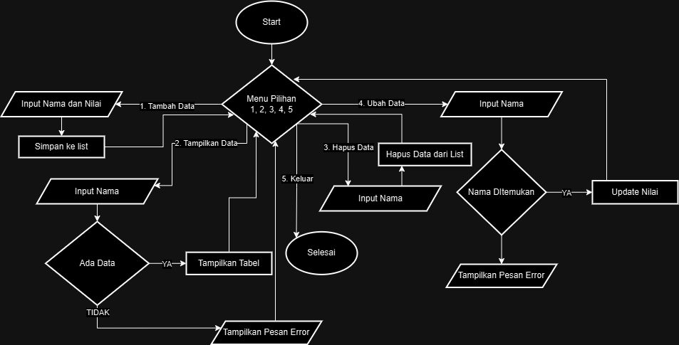

# TUGAS PRAKTIKUM 6
# Data Diri

Nama : Muhammad Aziz Tri Ramadhan

NIM : 312410380

Kelas : TI,24.A.3

# Flowchart 

# input dan outpu dari Praktikum 6

## 1. input tambah data 

## outpu tambah data 

## 2. input tampilkan data

## output tampilkan data 

## 3. input hapus data

## output hapus data

## 4.  input ubah data

## output uba data

# Penjelasan Algoritma:

## Program ini merupakan aplikasi manajemen data mahasiswa dengan beberapa fungsi utama:

1. Struktur Data:
   - Menggunakan list `data_mahasiswa` untuk menyimpan data mahasiswa
   - Setiap mahasiswa disimpan sebagai dictionary dengan dua kunci: 'nama' dan 'nilai'

2. Fungsi Utama:
   a. `tambah()`:
      - Memungkinkan pengguna menambahkan data mahasiswa baru
      - Meminta input nama dan nilai
      - Menyimpan data ke dalam list `data_mahasiswa`

   b. `tampilkan()`:
      - Menampilkan seluruh data mahasiswa yang tersimpan
      - Jika tidak ada data, menampilkan pesan khusus
      - Menampilkan data dalam format tabel dengan nomor urut

   c. `hapus(nama)`:
      - Menghapus data mahasiswa berdasarkan nama
      - Menggunakan list comprehension untuk membuat list baru tanpa nama yang dimaksud

   d. `ubah(nama)`:
      - Mengubah nilai mahasiswa berdasarkan nama
      - Mencari mahasiswa dengan nama tertentu
      - Memperbarui nilai jika nama ditemukan

   e. `menu()`:
      - Fungsi utama yang menjalankan program
      - Menampilkan menu pilihan
      - Menggunakan loop while untuk terus menampilkan menu
      - Memproses pilihan pengguna dengan percabangan (if-elif)
      - Memberikan opsi untuk keluar dari program

3. Alur Kerja Program:
   - Program dimulai dengan memanggil fungsi `menu()`
   - Pengguna dapat memilih berbagai operasi
   - Program akan terus berjalan hingga pengguna memilih keluar

# labpy6
# labpy6
# sheshe06
